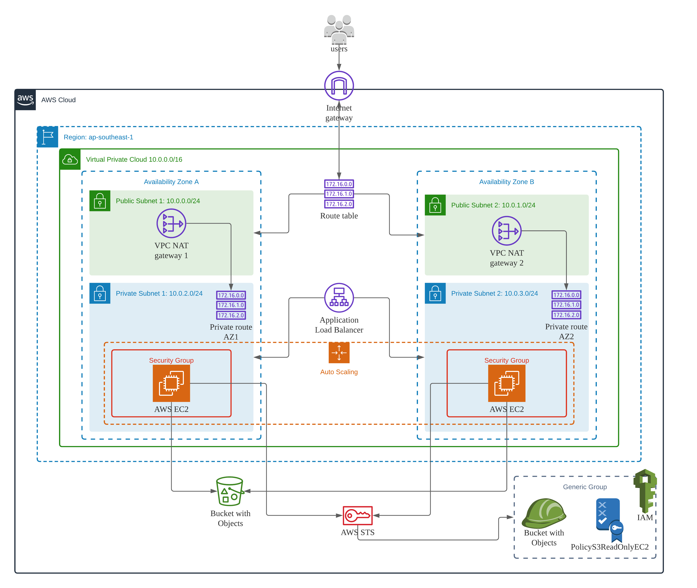

# High Availability Webapp using AWS CloudFormation

This project deploys a high-availability Web Application. 
AWS CloudFormation Infrastructure-as-code (IAC) automates the entire creation process and environment. The deployment uses packaged application that is staged in an AWS S3 bucket into a dockerized Apache Web Server. The script, written in a YAML files contains configurations needed to automate the entire deploymeny process so that the same coded infrastructure can be created, destroyed and recycled as when necessary.

## Prerequisites

1. AWS account

2. AWS command line interface (aws-cli) is installed and configured. IAM user is setup to perform the command line deployment.  
To test aws-cli installation, run the aws command in terminal: 

`aws --version` 
or  
`aws s3 ls` 

To check IAM user credential in aws-cli: 

`aws iam list-users`

and be sure the IAM user is setup with the administrator permission to perform necessary deployment steps.  
For more information on setting up IAM user for CloudFormation, see:  
https://medium.com/geekculture/step-by-step-guide-on-setting-up-cloudformation-iam-role-for-github-actions-cb227234a58b

## Project files
* infra_devops.yml : Udagram CloudFormation script for deploymeent
* infra_devops.json: Udagram CloudFormation script for parameter
* create-stack.sh : Cloudformation script to create stack 
* update-stack.sh : Cloudformation script to update stack 
* destroy-stack.sh : Cloudformation script to delete stack 
* /Deployment screenshots/ : Screenshots of the varied process from deployment

## To deploy Udagram app

`./create-stack.sh Udagram infra_devops.yml infra_devops.json`
